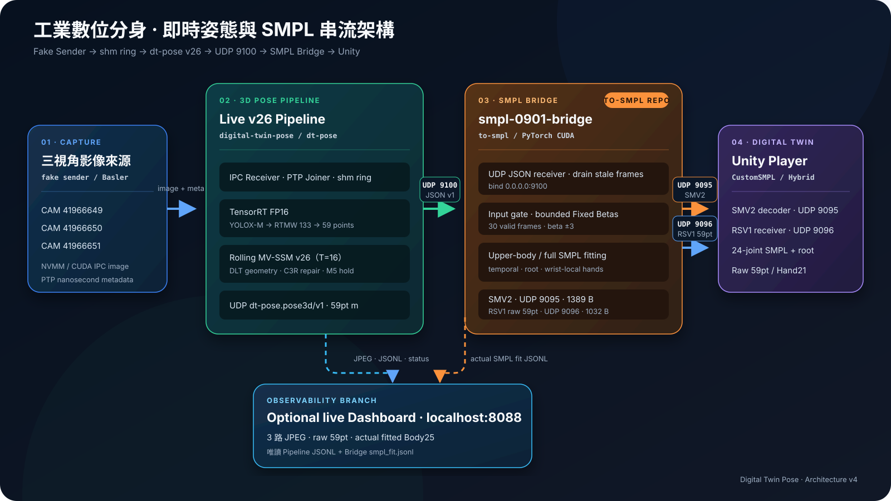

# SMPL 0901 Live Bridge (to-smpl)

這是一份可獨立放上 GitHub 的「`main_predict` 59 點 3D 關節 → SMPL → Unity」常駐即時轉換服務。它接在 3D 姿態估計管線（`dt-pose`）後面，不負責相機影像 IPC、2D pose 或 DLT；**輸入是已完成 3D 預測的 JSON 串流，原生支援新版 `dt-pose.pose3d/v1` 並向後相容 `factory_59pt_body_hands`；Bridge 平行輸出 Unity `SMV2`（UDP 9095）與原始 59 點 `RSV1`（UDP 9096）二進位封包**。

> 「0901 最佳版」指目前最適合即時串流的生產策略：固定體型（Fixed Betas）、姿勢 soft-target、跨幀 warm start、root motion 與原始 Hand21 混合驅動。在 GPU 上以 31.9 ms / 31.3 FPS 全速運行，兼顧全身骨架穩定度與手部靈活度。

---

## 1. 系統全景架構圖 (End-to-End Architecture)

本圖清楚展示完整資料流；橘色框標示 **本 Repository (`to-smpl`)** 的責任邊界：監聽 UDP 9100、接收 59 點 JSON，將原始骨架以 RSV1 送往 UDP 9096，並執行 SMPL 擬合後將 SMV2 送往 Unity UDP 9095。



公司部署與維運請見 [Docker 部署手冊](docs/DOCKER_DEPLOYMENT.md)；輸入 JSON、SMV2、RSV1 byte offset 與 CLI 合約請見 [UDP API 文件](docs/UDP_API.md)。

---

## 2. 輸入資料格式 (Input Stream: UDP 9100)

`to-smpl` 接收由 3D 姿態估計管線發送的 **JSON 格式 59 點 3D 關節資料**：

* **傳輸協定**：UDP Datagram（預設監聽 `udp://0.0.0.0:9100`）。
* **隊列機制**：非阻塞接收（Non-blocking Socket Drain）。每次 GPU 算完一幀，會清空 Socket 緩衝區中堆積的舊封包，只取最新抵達的一筆，確保延遲永遠維持在 ~30ms。
* **資料 Schema**：`dt-pose.pose3d/v1`（新版）或 `factory_59pt_body_hands`（舊版相容）

### JSON 結構範例
```json
{
  "schema": "dt-pose.pose3d/v1",
  "source": "rig_b",
  "frame": 1054,
  "timestamp_ns": 1725150000123456789,
  "units": "m",
  "layout": "factory59",
  "joints": [
    [-0.580, -0.853, -1.332],
    [-0.603, -0.829, -1.308],
    ...
    [0.653, -0.765, -1.765]
  ],
  "single_person": true
}
```

### 59 點關鍵點拓撲順序 (COCO-WholeBody 59-Point Subset)
| 索引區間 | 部位 | 包含關節 |
| :--- | :--- | :--- |
| **`0..16`** (共 17 點) | **Body17 軀幹與四肢** | `0`: 鼻子, `1, 2`: 左右眼, `3, 4`: 左右耳, `5, 6`: 左右肩, `7, 8`: 左右肘, `9, 10`: 左右手腕, `11, 12`: 左右髖, `13, 14`: 左右膝, `15, 16`: 左右腳踝 |
| **`17..37`** (共 21 點) | **Left Hand 左手** | `17`: 左手腕根部, `18..21`: 拇指, `22..25`: 食指, `26..29`: 中指, `30..33`: 無名指, `34..37`: 小指 |
| **`38..58`** (共 21 點) | **Right Hand 右手** | `38`: 右手腕根部, `39..42`: 拇指, `43..46`: 食指, `47..50`: 中指, `51..54`: 無名指, `55..58`: 小指 |

### 品質閘門保護
* **必要人體關節**：`[0, 5, 6, 7, 8, 9, 10, 11, 12, 13, 14, 15, 16]` 必須數值非 null。
* **下肢遮擋保護**：若工廠機台遮擋雙腳導致關節為 `null`（解析後為 NaN），系統會自動觸發 `holding the last Unity pose`，使 Unity 角色雙腳穩固站立於地面，上半身與手指持續動態追蹤。

---

## 3. 輸出資料格式 (Output Stream: UDP 9095 to Unity)

`to-smpl` 擬合完成後，打包成 **`Protocol V2 (SMV2)` 高效二進位封包** 送往 Unity：

* **傳輸協定**：UDP Datagram（發送至 `udp://UNITY_HOST:9095`）。
* **封包大小**：固定長度 1389 Bytes（小於常見 Ethernet MTU 1500，通常不需 IP fragmentation；UDP 本身不保證送達）。
* **二進位結構表**：

| 欄位名稱 | 型態與長度 | 說明 |
| :--- | :--- | :--- |
| **Magic Header** | `char[4]` | 固定為 ASCII 字串 `SMV2` |
| **Frame ID** | `uint32` | 影格流水編號 |
| **Legacy Translation** | `float32[3]` | 相容舊版位移 |
| **SMPL Pose** | `float32[156]` | 52×3 軸角 slots；目前 body 使用前 66 floats，雙手另由 Hand21 驅動 |
| **Root Position** | `float32[3]` | 骨盆相對於初始錨點的位移 (x, y, z 公尺) |
| **Pelvis World** | `float32[3]` | 世界座標系下的骨盆位置 |
| **Root Rotation** | `float32[4]` | 骨盆全域旋轉四元數 (qx, qy, qz, qw) |
| **Root Confidence**| `float32` | 骨盆估計信心度 |
| **Left Local Joints**| `float32[63]` | 左手 21 點相對於手腕的局部座標 (3D float32 x 21) |
| **Left Confidence** | `float32[21]` | 左手 21 點信心度 |
| **Right Local Joints**| `float32[63]` | 右手 21 點相對於手腕的局部座標 (3D float32 x 21) |
| **Right Confidence**| `float32[21]` | 右手 21 點信心度 |
| **Input Valid** | `uint8` | 1=輸入有效, 0=保持上一姿勢 |
| **Quality Metrics** | `float32[4]` | `inputScore`, `fitResidualMm` (MPJPE), `worstResidualMm`, `torsoOrientationDeg` |
| **Solver State** | `int32` | `TRACKING` (0), `RECOVERED` (1), `HOLD` (4) |
| **Steps Used** | `int32` | 擬合迭代步數 (預設 100) |
| **Reason Mask** | `uint32` | 異常原因位元遮罩 |

### Raw Skeleton V1（RSV1，UDP 9096）

Bridge 一收到並成功解析 UDP 9100 JSON，就會在任何單位轉換、軸向映射、品質閘門或 SMPL 擬合之前，將原始 59 點平行送至 `udp://RAW_SKELETON_HOST:9096`。因此即使該幀之後被 SMPL 品質閘門拒絕，RSV1 仍可供獨立接收器記錄或視覺化。

| 欄位名稱 | 型態與長度 | 說明 |
| :--- | :--- | :--- |
| **Magic Header** | `char[4]` | 固定為 ASCII `RSV1` |
| **Version** | `uint16` | 協定版本，目前為 `1` |
| **Flags** | `uint16` | bit 0：`ptp_epoch_ns` 為來源提供的精確 PTP；否則為時間戳回退值 |
| **Frame ID** | `uint32` | 對應輸入 JSON 的 `frame_index` |
| **PTP Epoch** | `uint64` | 奈秒級 epoch timestamp |
| **Unit** | `uint8` + 3 bytes padding | `0=unknown`、`1=m`、`2=mm` |
| **Coordinate Frame** | `char[64]` | UTF-8、NUL padding，來源座標系名稱 |
| **Raw Keypoints** | `float32[59][3]` | 輸入的原始 59×3 座標；無效關節可為 `NaN` |
| **Confidence** | `float32[59]` | 每點信心度 `[0,1]`；目前由 `reliable` 映射為 `1.0/0.0` |

RSV1 固定為 little-endian、封包大小 **1032 Bytes**，小於標準 Ethernet MTU。預設目標主機沿用 `--unity-host`，`--raw-skeleton-port 0` 可停用；此輸出不取代也不改變既有 UDP 9095 SMV2。

---

## 4. 0901 擬合策略與效能

| 方法 | MPJPE 誤差 | Endpoint 誤差 | 軀幹角度偏差 | 單幀耗時 / 幀率 |
| :--- | :---:| :---:| :---:| :---:|
| KAMA 100 iters | 15.35 mm | — | — | 62.8 ms (15.9 FPS) |
| KAMA adaptive | 8.18 mm | — | — | 56.9 ms (17.5 FPS) |
| **Fixed Betas + Soft Target（本版）** | **38.03 mm** | **9.44 mm** | **3.37°** | **31.9 ms / 31.3 FPS (全速即時)** |

### 核心演算法亮點
1. **Fixed Betas 體型鎖定**：前 10 幀擬合一次性身材參數 $\beta$ 後全程鎖定骨長，徹底消除動態辨識時人體骨頭伸縮抖動。
2. **端點加權 Soft-Target**：手腕與腳踝端點賦予 2.5 倍權重，確保工人操作工具與腳踩地面高度貼合。
3. **軀幹法向量約束 (Torso Normal Constraint)**：計算肩-髖法向量，防止工人背對鏡頭時模型發生前後翻轉。
4. **Hybrid 混合骨架驅動**：SMPL 驅動全身 24 處關節四元數，`RawHandRetargeter` 驅動 10 根手指原始幾何。

---

## 5. Docker（NVIDIA GB10 / ARM64）

Docker image 使用支援 GB10／Blackwell `sm_12x` 的 NVIDIA PyTorch base，SMPL 模型不會複製進 image；執行時以唯讀方式掛載 `models/`。Compose 使用 host network，讓 Pipeline 繼續送到 host UDP 9100，Bridge 也能直接將 9095/9096 送往 Unity。

本節提供快速啟動；公司主機的完整前置需求、模型目錄、GPU 驗證、網路規則、日常維運、更新方式與問題排查請依照 [Docker 部署手冊](docs/DOCKER_DEPLOYMENT.md)。

必要條件：Docker、Docker Compose、NVIDIA Container Toolkit。第一次建置會下載數 GB 的 NGC base image。

執行前置檢查與映像檔建置腳本：

```bash
cd /path/to/to-smpl
./prepare-gx10.sh
```

（該腳本會檢查必要 SMPL 模型是否存在並執行 `docker compose build`）

`UNITY_HOST` 不參與 image 建置；同一份 image 可部署到不同機器。啟動時才指定 Unity PC 的實際 LAN 或 VPN IPv4：

```bash
cd /path/to/to-smpl
sudo UNITY_HOST=192.168.200.1 docker compose up
```

若 Unity 與 Bridge 在同一台主機，使用 loopback：

```bash
sudo UNITY_HOST=127.0.0.1 docker compose up
```

若未設定 `UNITY_HOST`，容器會在啟動時立即停止並顯示設定提示，不會把目的位址寫死或誤送到其他主機。Unity 接收端須監聽 `0.0.0.0:9095`（SMV2）及 `0.0.0.0:9096`（RSV1）。

停止可按 `Ctrl+C`；SMPL models 預設由 `./models` 掛載到容器 `/models:ro`。若 models 位於別處：

```bash
sudo UNITY_HOST=192.168.200.1 \
  SMPL_MODELS_DIR=/absolute/path/to/models \
  docker compose up
```

> 此 Compose 不設定自動重啟，也不會操作 Pipeline、Fake Sender 或 Dashboard。

Bridge 沒有 HTTP/REST API；三個 UDP 介面的正式合約與 decoder 說明請見 [UDP API 文件](docs/UDP_API.md)。

---

## 6. 快速啟動指南

### 步驟 1：啟動 SMPL 0901 Bridge
```bash
# 在 to-smpl 目錄下啟動
smpl-0901-bridge \
  --input udp://0.0.0.0:9100 \
  --smpl-dir /path/to/to-smpl/models \
  --device cuda \
  --unity-host 127.0.0.1 \
  --unity-port 9095 \
  --raw-skeleton-host 127.0.0.1 \
  --raw-skeleton-port 9096
```

### 步驟 2：啟動 Pipeline 推送串流 (已內建於 run-gx10.sh)
```bash
cd /path/to/digital-twin-pose
./deploy/live_pipeline/run-gx10.sh
```

### 步驟 3：Unity 端一鍵對接
1. Unity 開啟專案，將 `unity/CustomSMPL` 複製至專案的 `Assets/CustomSMPL`。
2. 點選 Unity 上方選單：**CustomSMPL → Setup 0901 Live Bridge Player**。
3. 按下 **Play**，元件將自動綁定 UDP `9095` 埠號，以 30 FPS 即時驅動 3D 數位分身角色與 10 指抓握動態。

既有 Unity 元件只解析 9095 的 SMV2；若要顯示原始骨架，需另建一個監聽 UDP 9096 並解析 RSV1 的 receiver。兩路資料互相獨立。
